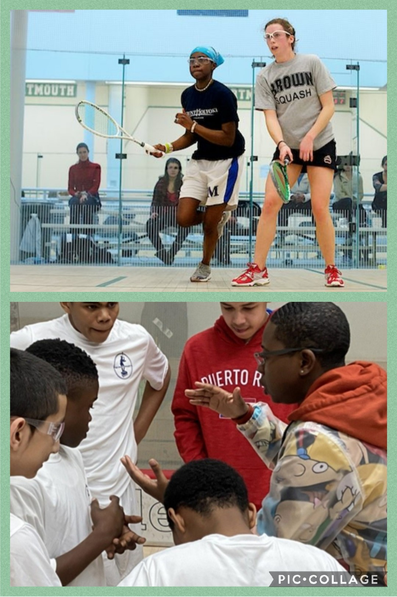

# Tempest-B
## Big Dreams For the Future of Squash and Myself

    My name is Tempest Bowden. I have been coaching squash since 2015 at a non-profit called SquashSmarts. 
As a both a former student and now coach, I have recognized that there are things happening in the squash community that I am not neccessarily a fan of.  As a result I have decided to be the very first black American to open a squash facility. This center will be a health and wellness center that will create equity in the sport and hopefully in the lives of the students I hope to impact.
}Over the pandemic, I began to learn about Day Trading and all of it's glory. However, I quickly began to to see that there was so much more that i could be doing to take better and smarter trades. So, I decided to take this class. I know that opening my own center will be a challenge and I will have to rely on the support of network.  I want to be able to do as much as I can on my own before doing that. I'd love to learn how to make a career in the FinTech field. After this class I will definitely be looking to do so. 
